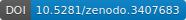

# SBMSplitMerge
SBMSplitMerge is an R package for performing inference on the number of blocks and the edge-state parameters in a Generalised Stochastic Block Model using a split-merge sampler.
This allows for inference in non-conjugate edge-state models in a Bayesian framework.

This package accompanies the paper [ArXiV https://arxiv.org/abs/1909.09421](https://arxiv.org/abs/1909.09421).

The git repository stores this package as well as the examples and data examples available on github: [](https://doi.org/10.5281/zenodo.3407683)

# Getting the package
install.packages("SBMSplitMerge")

# Model for the package
Suppose that you have network data in the form of counts of interaction between a set of $N$ animals.
You think the animals may display group like behaviour, via their interactions such that individuals in the same group have a higher change of interacting.
You also are unsure of the number of groups in the network.

Classic network modelling techniques are based on graphs where the interactions are binary. This is a major restriction.
Some methods allow the practitioner to specify a distribution for the interactions, so long as it has a conjugate prior.
A flexible model would allow the practitioner to place any distribution on the _interaction process_.

The number of groups or _blocks_ in the network is a key parameter. Some models in the literature set a joint prior on the number of blocks and assignment of individuals to blocks.
This can lead to too many smaller blocks and inconsistent posterior behaviour [c.f. Miller and Harrison](https://doi.org/10.1080/01621459.2016.1255636)

The GSBM allows an explicit prior on the number of groups and an arbitrary distribution for the interaction process.

## Using the package
Consider the example at the start of this section. Suppose the interactions are in a $N$ by $N$ matrix in R called \code{interacts}.
First, you must specify the parts of the model:
- the interaction process in a ``edgemod`` object
- the prior for the parameters of the edge-model in a ``parammod`` object
- the prior for the number of blocks in a ``blockmod`` object

The general method is to specify each of these objects in a list (named, say, ``model``), then call
```R
posterior <- sampler(interacts, model, 10000, "rj")
```
to run 10000 iterations of the split-merge sampler.
The returned list, ``posterior``, contains the trace for the number of blocks, parameter values, block memberships.

The output can be evaluated by some posterior diagnostic plots by calling
```R
print(eval_plots(posterior))
```
this will plot the traces of the above variables and a posterior probability that two individuals belong to the same block.

For details on setting the model up see the accompanying vignette for a negative binomial model:
```R
vignette("Weibull-edges")
```
